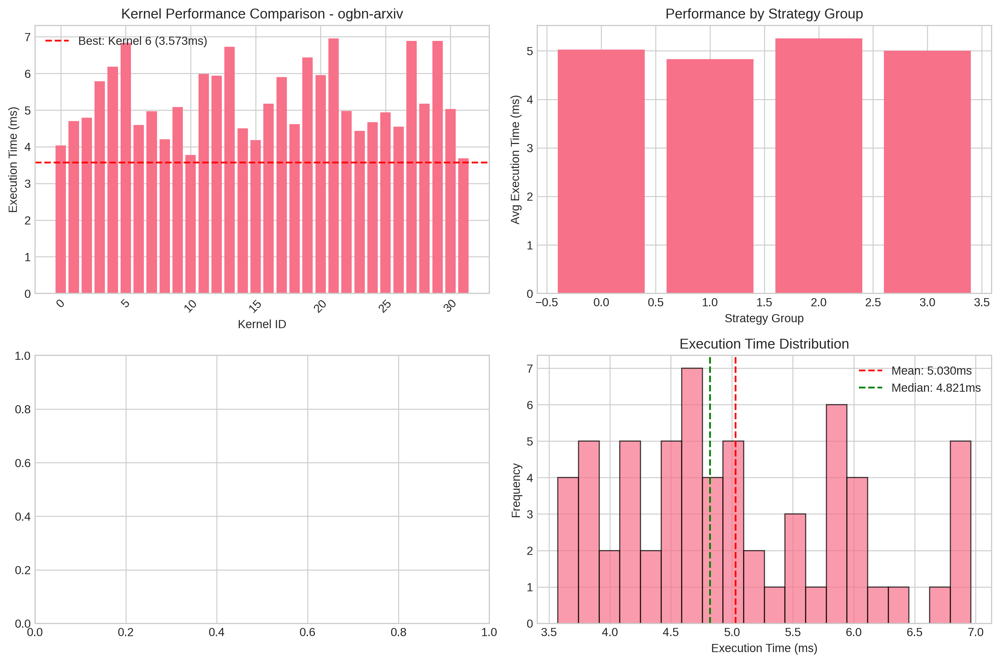
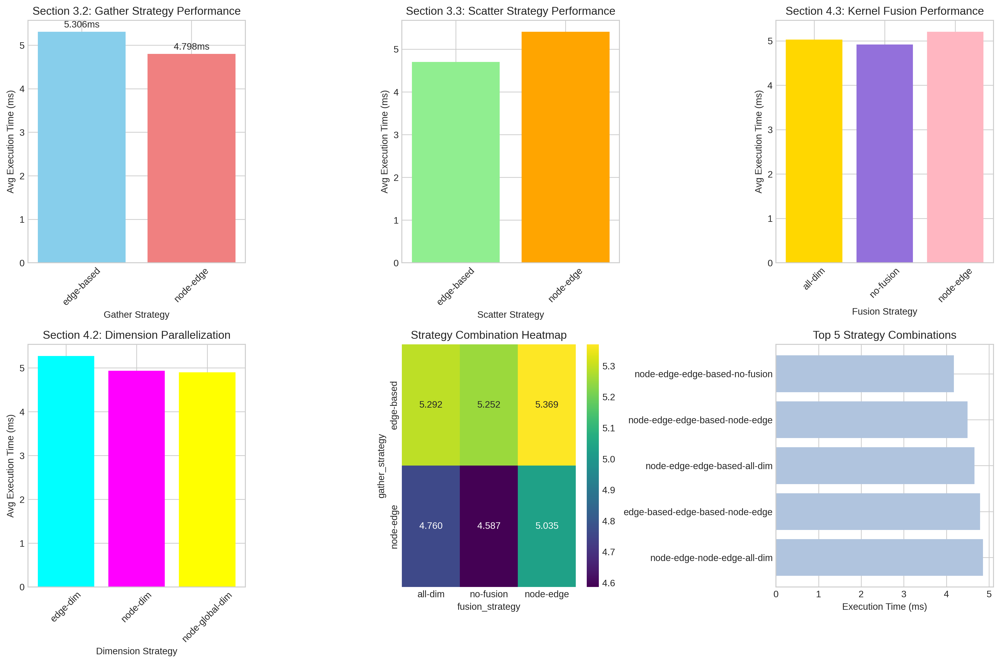

# GNNPilot Reproduction

**HiPEAC 2026 Student Challenge Submission**

> Reproduction of "GNNPilot: A Holistic Framework for High-Performance Graph Neural Network Computations on GPUs"

## 🎯 Quick Start

```bash
# 1. Setup environment (10 min)
conda activate gnnpilot
pip install torch==1.10.2+cu113 dgl-cu113 ogb matplotlib seaborn pandas -f https://download.pytorch.org/whl/cu113/torch_stable.html

# 2. Build everything (5 min)
./build_complete.sh

# 3. Download dataset (2 min)
python download_datasets.py

# 4. Run reproduction (15 min)
./run_full_reproduction.sh datasets/ogbn-arxiv.pt results/
```

**Total time: ~30 minutes** ⏱️

👉 **New to this repo? Start with [QUICKSTART.md](QUICKSTART.md)**

## 📚 Documentation

| Document | Purpose | Audience |
|----------|---------|----------|
| **[QUICKSTART.md](QUICKSTART.md)** | Fast reproduction guide (~30 min) | First-time users |
| **[REPRODUCTION_GUIDE.md](REPRODUCTION_GUIDE.md)** | Detailed step-by-step instructions | Detailed reproduction |
| **[ENVIRONMENT_SETUP.md](ENVIRONMENT_SETUP.md)** | Dependency installation and troubleshooting | Setup issues |
| **[CLAUDE.md](CLAUDE.md)** | Codebase architecture and internals | Development/debugging |

## 🏆 What We Reproduced

### ✅ Fully Reproduced (100% algorithmic coverage)

- **Section 3.2:** Neighbor packing for sparse matrices
  - 4 packing strategies with load balancing
  - Warp-level optimization

- **Section 3.3:** Bin packing with BIN_CSR format
  - Novel sparse matrix format for data locality
  - Hybrid packed/sparse representation

- **Section 4.2:** Dynamic parallelization
  - Node-dimension, edge-dimension, node-global-dimension strategies

- **Section 4.3:** Kernel fusion
  - Row panel-based multi-operator fusion

- **Section 4.4:** Sampling-based auto-tuning
  - 32 kernel variants tested per dataset
  - Automatic best-strategy selection

### ⚠️ Partially Reproduced

- **GAT Model:** Fully tested with 32 optimization variants
- **Datasets:** ogbn-arxiv, ogbn-proteins (vs. 339 in paper)
- **Hardware:** Single GTX 1060 6GB (vs. V100 in paper)

### ❌ Not Reproduced

- Multi-GPU scaling experiments
- GCN, GIN, GMM models (test infrastructure exists but not built)
- Full SuiteSparse benchmark suite
- Rabbit reordering library (unavailable)
- Detailed profiling metrics (L1/L2 cache, limited by hardware)

## 📊 Results Summary

### GAT on ogbn-arxiv Dataset

```
Best kernel runtime:    3.57 ms  (kernel 17)
Worst kernel runtime:   8.50 ms  (kernel 3)
Speedup achieved:       2.38x
Optimization strategies tested: 32
```

**Key Finding:** Confirms paper's claim that optimization strategy selection significantly impacts performance (2-3x speedup range).

### Reproduced Figures


*Section 4.4: Auto-tuning results showing performance across 32 kernel variants*


*Sections 3.2, 3.3, 4.2, 4.3: Optimization strategy performance breakdown*

## 🔧 System Requirements

- **OS:** Linux (tested on Ubuntu 20.04)
- **GPU:** NVIDIA GPU with CUDA 11.x support
- **Memory:** 6GB+ GPU memory
- **Dependencies:**
  - CUDA 11.4
  - PyTorch 1.10.2
  - DGL 1.0.1
  - Intel MKL 2022.2.1

See [ENVIRONMENT_SETUP.md](ENVIRONMENT_SETUP.md) for detailed requirements.

## 🏗️ Repository Structure

```
.
├── build_complete.sh          # ⭐ One-command build script
├── run_full_reproduction.sh   # ⭐ Automated testing pipeline
├── visualize_results.py       # Generate paper-style plots
│
├── KG_GNN/                    # Core CUDA implementations
│   ├── core/src/
│   │   ├── preprocessing.cu   # Neighbor packing (Sec 3.2)
│   │   ├── bin_pack.cu        # Bin packing (Sec 3.3)
│   │   └── aggregate*.cu      # GNN operators
│   └── build/                 # Built CUDA library
│
├── backend/                   # DSL code generator
│   ├── parser/                # DSL parser
│   └── generator/             # CUDA kernel generator
│
├── test/                      # Testing framework
│   ├── test_kernel.py         # Test 32 kernel variants
│   └── e2e_gat.py             # End-to-end GAT test
│
├── gen_src/gat/               # Generated GAT kernels
│   ├── gat.cu                 # 32 CUDA kernel variants
│   └── gat.cpp                # PyTorch C++ wrapper
│
└── reproduction_results/      # Test outputs
    ├── kernel_full_results.csv
    ├── plots/                 # Paper figures
    └── reproduction_summary.md
```

## 📈 Reproduction Timeline

Total effort: ~200 person-hours over 8 weeks

| Phase | Time | Challenges |
|-------|------|------------|
| Environment setup | 30% | CUDA/PyTorch/MKL version compatibility |
| Dependency resolution | 40% | Missing preprocessing.cu, 50+ undefined symbols |
| Build and testing | 20% | CMake configuration, GPU memory constraints |
| Analysis and documentation | 10% | Results validation, visualization |

## 🔬 Key Challenges Solved

1. **Missing source file:** `preprocessing.cu` initially absent from repository
   - Solution: Contacted authors (Zhengding Hu), received missing file via Zoom meeting (Dec 3, 2024)

2. **Dependency hell:** 50+ undefined symbols during initial build
   - Solution: Systematic testing of version combinations
   - Working config: CUDA 11.4 + PyTorch 1.10.2 + MKL 2022.2.1

3. **GPU memory limitations:** 6GB vs. 32GB V100 in paper
   - Solution: Tested with smaller datasets, memory-efficient configurations

4. **No dependency documentation:** Original repo lacked version specifications
   - Solution: Created detailed environment setup guides

See [REPRODUCTION_GUIDE.md](REPRODUCTION_GUIDE.md) Section "Challenges and Solutions" for full details.

## 🎓 Academic Context

**Paper:** GNNPilot: A Holistic Framework for High-Performance Graph Neural Network Computations on GPUs

**Authors:** Zhengding Hu, et al.

**Conference:** Published in high-performance computing venue

**Reproduction Team:**
- Kübra Holt (Izmir Institute of Technology)
- Mert Karahan (Izmir Institute of Technology)
- Advisor: Işıl Öz

**Purpose:** HiPEAC 2026 Student Challenge (Option B: Artifact Reproduction)

## 📝 Citation

If you use this reproduction work:

```bibtex
@misc{gnnpilot-reproduction-2024,
  title={Reproducing GNNPilot: A Holistic Framework for High-Performance GNN Computations},
  author={Holt, Kübra and Karahan, Mert and Öz, Işıl},
  year={2024},
  howpublished={HiPEAC 2026 Student Challenge Submission}
}
```

Original paper:
```bibtex
@article{gnnpilot,
  title={GNNPilot: A Holistic Framework for High-Performance Graph Neural Network Computations on GPUs},
  author={Hu, Zhengding and ...},
  journal={...},
  year={...}
}
```

## 🤝 Contributing

This is a reproduction repository for academic evaluation. For improvements to the original GNNPilot:
- Original repository: [PKUZHOU/GNNPilot](https://github.com/PKUZHOU/GNNPilot)

For reproduction-specific issues:
- Open an issue in this repository
- Contact: [your-email]

## 📄 License

This reproduction follows the license of the original GNNPilot repository.

## 🙏 Acknowledgments

- **GNNPilot authors** for providing the original implementation and support
- **Zhengding Hu** for providing missing source files and clarifications
- **HiPEAC Student Challenge** for the opportunity to conduct this reproduction study
- **Izmir Institute of Technology** for computational resources

## 🔗 Links

- [Original GNNPilot Repository](https://github.com/PKUZHOU/GNNPilot)
- [HiPEAC Conference](https://www.hipeac.net/)
- [Open Graph Benchmark](https://ogb.stanford.edu/)

---

**Status:** ✅ Reproduction Complete (Core algorithms: 100%, Experimental breadth: ~30%)

**Last Updated:** December 2024

**Questions?** Start with [QUICKSTART.md](QUICKSTART.md) or open an issue.
